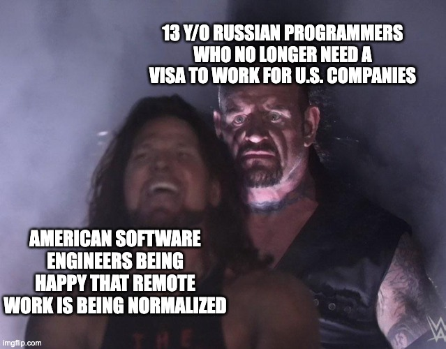

class: inverse


```{r, echo=F, message=F, warning=F}
# options(htmltools.dir.version = FALSE)
library(knitr)
opts_chunk$set(
  fig.align="center",  
  fig.height=4, 
  dev = "svg",
  #fig.width=6,
  # out.width="748px", #out.length="520.75px",
  # dpi=300, #fig.path='Figs/',
  cache=T, echo=F, warning=F, message=F
)
library(hrbrthemes)
library(fontawesome)
library(xaringan)
library(xaringanExtra)
library(tidyverse)
# library(here)
library(xaringanthemer)
xaringanExtra::use_panelset()


library(knitr)
opts_chunk$set(
  fig.align="center",  
  fig.height=4, 
  # dev = "svg",
  #fig.width=6,
  # out.width="748px", #out.length="520.75px",
  # dpi=300, #fig.path='Figs/',
  cache=T, echo=F, warning=F, message=F
)

```

```{r}
xaringanExtra::use_progress_bar(color = "#EB821D", location = "top", height = "5px")
```


# Riksvakanslistan

.pull-left[

## Plan

1. [What is the source?](#source)

2. [Where does it fit in?](#fit)

3. [How can we digitize it?](#digitize)


]

.pull-right[

```{r}
# knitr::include_graphics("data/riksvakanslistan/riksvakanslistan_21_09_1927_small_tall.jpg")
```


]


---

# Context

What do we see in Sweden in the first half of the 20th C?

Shoutout office mate Anton Svensson!

He finds an emergent middle class and a makred shift in the kinds of jobs that top earners do.

See the table on richest individuals in his sample in Malmö:

There is a shift from merchants in 1905 to Executives and engineers.

We want to find why this might be the case?!

one way might be to look at the 1% sample that Erik and Jakob have created.

One other ting we coul do is try and measure the new kinds of jobs that are created and those that are destroyed.

---

# Trendy topic

### A few ways in to the topic:

.panelset[
.panel[.panel-name[Automation risk]

The future of work 

```{r, out.width="60%"}
knitr::include_graphics("slides/exposure_risk.png")
```

]

.panel[.panel-name[Emergent middle class]

```{r, out.width="60%"}
knitr::include_graphics("slides/Ridgeplot_Anton.jpeg")
```

See table from [Anton]()

]

.panel[.panel-name[Technological change]

```{r, out.width="60%"}
knitr::include_graphics("slides/automation_augmentation.png")
```


]]

---
# What literature do we build on?

.panelset[
.panel[.panel-name[Automation risk]

The future of work 

```{r, out.width="60%"}
knitr::include_graphics("slides/exposure_risk.png")
```

]

.panel[.panel-name[Emergent middle class]

```{r, out.width="60%"}

```

See table from [Anton]()

]

.panel[.panel-name[Technological change]

```{r, out.width="60%"}
knitr::include_graphics("slides/automation_augmentation.png")
```


]]


---


# Automation and augmentation

### How has technology augmented labour demand and how has it automated away labour?

.pull-left[


]

---

```{r, out.width="60%"}
include_graphics("slides/automation_augmentation.png")
```


---
# Why this technology/period?

.pull-left[

<blockquote>
Between 1915 and 1920 the proportion of the country's arable land belonging to farms with electricity increased from 5 to almost 40 per cent

</blockquote>
- [Vattenfall archive](https://history.vattenfall.com/stories/the-revolution-of-electricity/how-electricity-conquered-the-countryside)
]

.pull-right[

```{r, out.width="80%"}
include_graphics("slides/vattenfall_consumption.jpg")
```


]

---


# How do we measure technological change?

Focussing 

---

class: inverse, center, middle
name: digitize

# How can we digitize it?

<html><div style='float:left'></div><hr color='#EB811B' size=1px width=796px></html>

---

class: inverse, middle

# Regular extraction pipeline

- On my local machine

- Based on regular expression

- Works fine for text

---

# Regular extraction pipeline

.panelset[
.panel[.panel-name[Pre-processing image]

.pull-left[

```{r, eval=F, echo=T}
image <- image_read(here("data", "riksvakanslistan", "kontor.PNG"))

image %>% 
  # tune this parameter
  image_deskew(threshold = 1000) %>% 
  image_despeckle() %>% 
  # makes grayscale
  image_quantize(max = 255, 
                 colorspace = "gray", 
                 dither = T) %>% 
  image_write(here("data", "riksvakanslistan", "kontor_processed.PNG"))
```


]

.pull-right[

```{r, fig.cap="Original image"}
knitr::include_graphics("data/riksvakanslistan/kontor.PNG")
```

```{r, fig.cap="Processed image"}
knitr::include_graphics("data/riksvakanslistan/kontor_processed.PNG")
```

]

]

.panel[.panel-name[Extract text]

.pull-left[

```{r, echo=T, eval=F}
library(tesseract)

text <- image %>% 
  # use Swedish language model
  image_ocr(language = "swe")

text
```

]

.pull-right[

```{r}
text <- read_rds("data/riksvakanslistan/text.rds")

text %>% 
  str_squish() %>% 
  knitr::kable(col.names = "Text")
```

]
]


.panel[.panel-name[Transform text]

.pull-left[

```{r, echo=T, eval=F}
text %>% 
  as_tibble() %>% 
  separate_rows(value, sep = "\\;") %>% 
  mutate(value = str_remove(value, "Kontor i:"),
         value = str_squish(value)) %>% 
  separate(value, into = c("Region", "Offices"), sep = "\\:") %>% 
  mutate(Offices = str_squish(Offices))
```

]

.pull-right[

```{r}
text <- read_rds("data/riksvakanslistan/text.rds")

text %>% 
  as_tibble() %>% 
  separate_rows(value, sep = "\\;") %>% 
  mutate(value = str_remove(value, "Kontor i:"),
         value = str_squish(value)) %>% 
  separate(value, into = c("Region", "Offices"), sep = "\\:") %>% 
  mutate(Offices = str_squish(Offices)) %>% 
  filter(!is.na(Offices)) %>% 
  head() %>% 
  knitr::kable()

```


]
]]

---

class: inverse, middle

# AWS Extraction pipeline

- Uses fancy Amazon services Textract and Comprehend

- Based on deep learning

- Works well for tables when you have a good quality scan

---

# AWS Extraction pipeline

```{r}
knitr::include_graphics("data/riksvakanslistan/AWS_pipeline (1).svg")
```

---
# AWS Extraction pipeline

### Demo:

.pull-left[

```{r}
knitr::include_graphics("data/riksvakanslistan/gold_standard_1_processed.JPG")
```

]

.pull-right[

```{r}
df <- read.csv("output_1.csv") %>% as_tibble()

df %>% knitr::kable(col.names = c("", "1929", "1930", "1931", "1931", "1931", "1931"))
```


]

