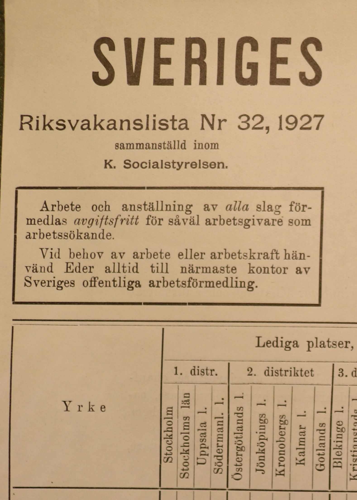
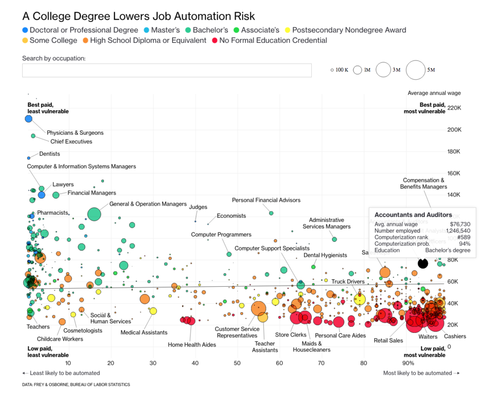

class: inverse


```{r, echo=F, message=F, warning=F}
# options(htmltools.dir.version = FALSE)
library(knitr)
opts_chunk$set(
  fig.align="center",  
  fig.height=4, 
  dev = "svg",
  #fig.width=6,
  # out.width="748px", #out.length="520.75px",
  # dpi=300, #fig.path='Figs/',
  cache=T, echo=F, warning=F, message=F
)
library(hrbrthemes)
library(fontawesome)
library(xaringan)
library(xaringanExtra)
library(tidyverse)
# library(here)
library(xaringanthemer)
xaringanExtra::use_panelset()


library(knitr)
opts_chunk$set(
  fig.align="center",  
  fig.height=4, 
  # dev = "svg",
  #fig.width=6,
  # out.width="748px", #out.length="520.75px",
  # dpi=300, #fig.path='Figs/',
  cache=T, echo=F, warning=F, message=F
)

```

```{r}
xaringanExtra::use_progress_bar(color = "#EB821D", location = "top", height = "5px")
```


# Riksvakanslistan

.pull-left[

## Plan

1. [What is the source?](#source)

2. [Where does it fit in?](#fit)

3. [How can we digitize it?](#digitize)


]

.pull-right[

```{r}
# 
```


]


---

# Context

What do we see in Sweden in the first half of the 20th C?

Shoutout office mate Anton Svensson!

He finds an emergent middle class and a makred shift in the kinds of jobs that top earners do.

See the table on richest individuals in his sample in Malmö:

There is a shift from merchants in 1905 to Executives and engineers.

We want to find why this might be the case?!

one way might be to look at the 1% sample that Erik and Jakob have created.

One other ting we coul do is try and measure the new kinds of jobs that are created and those that are destroyed.

---

# Trendy topic

### A few ways in to the topic:

.panelset[
.panel[.panel-name[Automation risk]

The future of work 

```{r, out.width="60%"}

```

]

.panel[.panel-name[Emergent middle class]

```{r, out.width="60%"}
knitr::include_graphics("slides/IMG_0394.PNG")
```

See table from [Anton]()

]

.panel[.panel-name[Technological change]

```{r, out.width="60%"}
knitr::include_graphics("slides/automation_augmentation.png")
```


]]

---
# What literature do we build on?

.panelset[
.panel[.panel-name[Automation risk]

The future of work 

```{r, out.width="60%"}

```

]

.panel[.panel-name[Emergent middle class]

```{r, out.width="60%"}
knitr::include_graphics("slides/IMG_0394.PNG")
```

See table from [Anton]()

]

.panel[.panel-name[Technological change]

```{r, out.width="60%"}
knitr::include_graphics("slides/automation_augmentation.png")
```


]]


---


# Automation and augmentation

### How has technology augmented labour demand and how has it automated away labour?

.pull-left[


]

---

```{r, out.width="60%"}
include_graphics("slides/automation_augmentation.png")
```


---
# Why this technology/period?

.pull-left[

<blockquote>
Between 1915 and 1920 the proportion of the country's arable land belonging to farms with electricity increased from 5 to almost 40 per cent

</blockquote>
- [Vattenfall archive](https://history.vattenfall.com/stories/the-revolution-of-electricity/how-electricity-conquered-the-countryside)
]

.pull-right[

```{r, out.width="80%"}
include_graphics("slides/vattenfall_consumption.jpg")
```


]

---


# How do we measure technological change?

Focussing 
