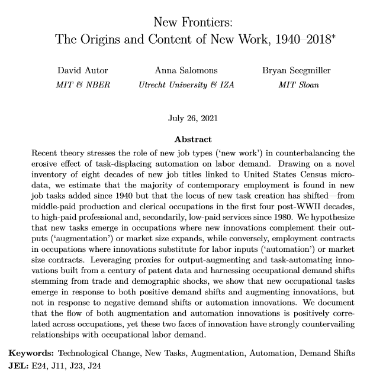
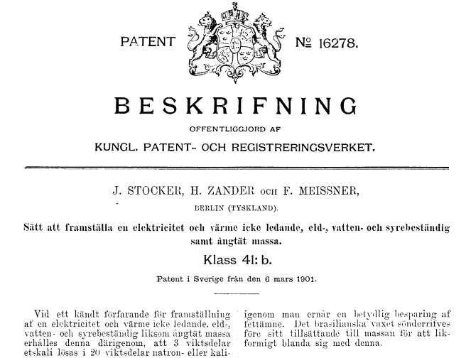
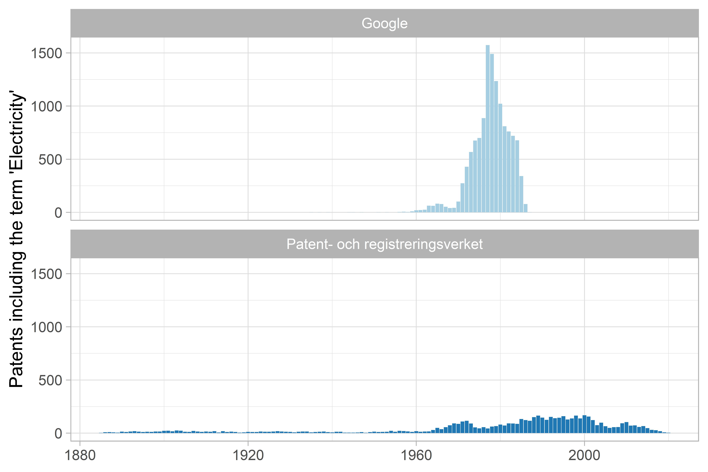

class: inverse, center, middle


```{r, echo=F, message=F, warning=F}
# options(htmltools.dir.version = FALSE)
library(knitr)
opts_chunk$set(
  fig.align="center",  
  fig.height=4, 
  dev = "svg",
  #fig.width=6,
  # out.width="748px", #out.length="520.75px",
  # dpi=300, #fig.path='Figs/',
  cache=F, echo=F, warning=F, message=F
)
library(hrbrthemes)
library(fontawesome)
library(xaringan)
library(xaringanExtra)
library(tidyverse)
# library(here)
library(xaringanthemer)
xaringanExtra::use_panelset()

theme_set(theme_light())

```

```{r}
xaringanExtra::use_progress_bar(color = "#EB821D", location = "top", height = "5px")
```

# The electrification of Sweden and its consequences for the labour market

---

# TOC

.pull-left[

## Plan

1. [Why electricity?](#source)

2. [Update on last presentation](#fit)

3. [P1: What kinds of new work are created?](#digitize)

4. [P2: Who did this work and with which skills?](#questions)

]

.pull-right[

```{r}
knitr::include_graphics("slides/porjus_hydro.jpg")
```

.center[[Porjus Hydro Plant](https://history.vattenfall.com/stories/from-hydro-power-to-solar-cells/the-pioneer-power-stations) in 1914]

]

---
class: inverse, center, middle
name: fit

# Why electricity?

<html><div style='float:left'></div><hr color='#EB811B' size=1px width=796px></html>

---

# Why electricity?

.pull-left[

Electrification in the early 20th century had a revolutionary impact on the economy
- Lessened the reliance on direct energy  
- Mechanized many tasks

**Agriculture:** Threshing, cleaning, grinding
**Manufacturing:** Increased flexibility in how machines could be placed within the factory, shopfloors became less dark and crowded.


]

.pull-right[

```{r}
knitr::include_graphics("https://upload.wikimedia.org/wikipedia/commons/6/6b/Batteuse_1881.jpg")
```


]
---
# Why electricity in Sweden?

.pull-left[

### Labour from agric. to new indutry

```{r}
df <- readxl::read_excel("slide_data/employment_by_industry_Sweden_new.xls", skip = 5)

library(ggiraph)

g <- df %>%
  mutate(Year = as.numeric(Year)) %>%
  pivot_longer(-Year) %>%
  filter(!name %in% c("Total aggregate economy", "Total private sector")) %>%
  mutate(tooltip = str_c("Number of employees ", scales::number(value, accuracy = 1))) %>%
  ggplot(aes(Year, value, fill = name, tooltip = tooltip)) +
  geom_tile_interactive(position = "fill") +
  scale_fill_brewer(palette = "Paired") +
  scale_y_continuous(labels = scales::percent_format()) +
  theme(legend.position = "bottom") +
  guides(fill = guide_legend(nrow = 4, byrow = TRUE)) +
  labs(
    caption = "Source: Edvinsson, R. Number of employees in eight types of activities in Sweden 1850-2000\nVia Historia.se",
    fill = NULL,
    y = "Employment composition",
    title = "Employment by sector in Sweden",
    subtitle = "1850-2000"
  )

ggiraph(ggobj = g)

```

.center[Number of employees in eight types of activities in Sweden 1850-2000 [Edvinsson](http://www.historicalstatistics.org/)]


]


.pull-right[

### Agric. falling share of output

```{r}
gg <- read_rds("slide_data/gg_industry.rds")

ggiraph(ggobj = gg)
```

.center[Manufacturing output from 1800 to 2000 in Sweden [Schön](http://www.historia.se/nominaloutputvalueaddedinputofactivitiesinmanufacturing.xls)]


]


---
# Why electricity in Sweden?

.pull-left[

### Rapid expansion of general purpose technology

<blockquote>

Between 1915 and 1920 the proportion of the country's arable land belonging to farms with electricity increased from 5 to almost 40 per cent

</blockquote>

]

.pull-right[


```{r, out.width="80%"}
include_graphics("slides/vattenfall_consumption.jpg")
```

.center[[Vattenfall archive](https://history.vattenfall.com/stories/the-revolution-of-electricity/how-electricity-conquered-the-countryside)]

]

---

# Why electricity in Sweden?

.pull-left[

### Previous study: Is there a link from electricity adoption to labor conflict? 

Data: 
- All Swedish parishes over the 1890 to 1920 period
- Geocoded data on strikes
- Information on the roll-out of the electricity grid
]

.pull-right[

```{r}
knitr::include_graphics("slides/more_power_diagram.png")
```

]

---

# Why electricity in Sweden?

.pull-left[


### Ties into debates on skill-biased technological change we have today

- 'Hollowing out' of labour market

- Agglomeration economies and increased urbanisation
 
- [Northvolt](https://northvolt.com/) and reinvestment in Northern manufacturing
]

.pull-right[

```{r}
knitr::include_graphics("https://www.datocms-assets.com/38709/1650359948-ultra-fast-1.png?auto=format&w=800")
```


]

---
class: inverse, center, middle
name: fit

# Update on previous presentation

<html><div style='float:left'></div><hr color='#EB811B' size=1px width=796px></html>

---
# Quantifying new types of work

.pull-left[

Last time we told you about some vacancy lists:

- Helping to measure what skills were required and where

- And measure new types of work

- Later we explain how to measure this

]

.pull-right[

```{r}
knitr::include_graphics("slides/distriktvakanslistan_crop.jpg")
```

]


---
class: inverse, center, middle
name: fit

# P1: What kinds of new work are created?

<html><div style='float:left'></div><hr color='#EB811B' size=1px width=796px></html>

---

# Measuring new kinds of work

.pull-left[
#### How can we measure **new tasks** and new work that emerge over time?

#### How can we measure if a particular technology **substituted for labour** or **augmented** it?
]

.pull-right[

```{r, fig.cap="Autor, Salomons and Seegmiller (2021)"}

```


]


---

# Methodology

### What is labour automation?

.pull-left[

The content of human work is replaced by machines:

For example, a letter sorting machine replaces a human mail sorter.

]

.pull-right[

```{r}
knitr::include_graphics("slides/mail-sorting-machine.jpg")
```


]

---

# Methodology

### What is labour augmentation?

.pull-left[

Innovations create new demands for expert knowledge and specific competencies that drive **occupational specialization** and hence the creation of new work tasks. 

For example, the invention of solar panels created the demand for solar photovoltaic engineers.

]

.pull-right[

```{r}
knitr::include_graphics("slides/solar-install.jpg")
```

]
---

class: inverse, center, middle

# How do we know if a technology is labour augmenting or labour replacing?

---

# Methodology

### Following methodology of [Autor, Salomons, Seegmiller (2021)](https://economics.mit.edu/files/21810)

<br>

.pull-left[

We want to compare three texts and find the similarity between:


* Types of new technology being brought to market, e.g. patents

and

1. Labour outputs, e.g. occupational titles, and

1. Labour inputs, e.g. a description of what the worker does


]


.pull-right[

```{r}
library(gt)

autor_needs <- tibble(title = "Medical Technologist",
       tasks = "Performs medical laboratory tests, procedures, analyses to provide data for diagnosis, treatment and prevention of disease",
       tech = "Theranos blood testing machine that can do all of the tests")

autor_sources <- c(title = "From the Census Index of Alphabetical Occupations",
                   tasks = "From the Dictionary of Occupational Titles",
                   tech = "From US patent database")

# autor_needs %>% kable(col.names = c("Title", "Task", "Tech"))

icons <- tibble(title = "figures/icons/titles.svg",
                tasks = "figures/icons/descriptions.svg",
                tech = "figures/icons/patents.svg")

autor_needs <- autor_needs %>% 
  bind_rows(autor_sources) %>% 
  bind_rows(icons)

autor_needs %>%
  relocate(tech, .before = title) %>% 
  gt() %>%
  # tab_header(title = "Example of comparison") %>%
  tab_style(
    style = cell_borders(sides = "l", color = "grey20", style = "solid", weight = "1px"),
    locations = cells_body(
      columns = everything(),
      rows = everything()
    )
  ) %>%
  tab_style(
    style = cell_text(align = "center"),
    locations = cells_body(
      columns = everything(),
      rows = 3
    )
  ) %>%
  cols_label(
    title = md("**Title**"),
    tasks = md("**Task**"),
    tech = md("**Tech**")
  ) %>%
  text_transform(
    locations = cells_body(
      columns = c(title, tasks, tech),
      rows = 3
    ),
    fn = function(x) {
      local_image(
        filename = paste0(x),
        height = as.numeric(75)
      )
    }
  ) %>% 
    tab_style(
    style = cell_fill(color = "#D3D3D3", alpha = .7),
    locations = cells_column_labels(columns = everything())
  ) %>% 
    gt::tab_style(
    style = list(
      cell_text(style = "italic")
    ),
    locations = list(
      cells_body(
        # cols = gt::everything(),
                 rows = 2)
    )
  )

```


]

---

# How do we measure closeness?

```{r}
knitr::include_graphics("slides/word2vec.png")
```

.center[Word2Vec word embedding example from [Google AI](https://arxiv.org/abs/1301.3781)]

---

# How do we measure closeness?

```{r}
# knitr::include_graphics("slides/word2vec.png")
```

<!-- .center[Word2Vec word embedding example from [Google AI](https://arxiv.org/abs/1301.3781)] -->

---

# Labour automation example

.left-column[

<br>

```{r}
knitr::include_graphics("slides/mail-sorting-machine.jpg")
```

]

.right-column[


The text of patent **US3938435A: Automatic mail processing apparatus** reads:

<blockquote>

Linear sorting machines in which incoming letters are removed from a stream at selected points, for use in a post office.

</blockquote>

The closest task description is for **DOT Code: 209.687-014: Mail handler or distribution clerk** which reads:

<blockquote>

Sorts and processes mail in post office: Sorts incoming or outgoing mail into mail rack pigeonholes or into mail sacks according to destination


</blockquote>


]

---

# Labour augmentation example

.left-column[

<br>

```{r}
knitr::include_graphics("slides/solar-install.jpg")
```

]

.right-column[

The text of patent **US7605498B2: Systems for highly efficient solar power conversion** reads:

<blockquote>

These devices create a photovoltaic DC current through the photovoltaic effect. Often these solar cells are linked together electrically to make a combination of cells into a solar panel or a PV (photovoltaic) panel...

</blockquote>

The closest title in the CAI is for ** Solar photovoltaic electrician**


]
---

# Methodology

```{r}
include_graphics("slides/electricity_patents.jpg")
```

---

# What do we add to Autor and the gang?

.panelset[

.panel[.panel-name[An earlier period/country]

```{r}

tibble(names = c("Lin (2011)",
                 "Autor, Salomons, Seegmiller (2021)",
                 "Our project"),
       begin = c(1980, 1940, 1900),
       end = c(2000, 2020, 1960),
       y = c(1, 2, 3)
       ) %>% 
  ggplot(aes(y = y, label = names, x = begin, xend = end, yend = y, colour = names)) +
  geom_segment(cex = 3) +
  geom_label(aes(x = end, y = y, label = names), vjust = 1.5) +
  scale_color_brewer(palette = "Dark2") +
  theme(legend.position = "none") +
  theme(panel.grid.major.y = element_blank(),
        panel.grid.minor.y = element_blank(),
        axis.text.y = element_blank(),
        axis.ticks.y = element_blank()) +
  labs(x = "Years examined",
       y = NULL) +
  coord_cartesian(ylim = c(0.8, NA),
                  xlim = c(NA, 2050))

```


]

.panel[.panel-name[Geographic dimension]


```{r, fig.height=5}
library(sf)
library(scales)

office_locations <- read_rds("data/riksvakanslistan/office_locations.rds") %>%
  filter(!is.na(lat))

office_locations <- st_as_sf(office_locations, coords = c("long", "lat"), crs = 4326)

lan_map_24 <- read_rds("data/riksvakanslistan/county_map/county_map.rds")


lan_map_24 %>%
  ggplot() +
  geom_sf(
    aes(
      fill = population
    )
  ) +
  geom_sf(colour = "midnightblue", data = office_locations) +
  scale_fill_viridis_c(trans = "sqrt", labels = scales::number_format()) +
  labs(
    title = "Location of Arbetsförmedlingen offices in 1927",
    fill = "Population in 1930"
  ) +
  theme_void()
```


]

.panel[.panel-name[Specific technology]

.pull-left[

```{r}

```


]

.pull-right[

```{r}

```


]

]

]


---
# Data requirements

```{r}
icons <- tibble(icons = c("figures/icons/titles.svg", "figures/icons/descriptions.svg", "figures/icons/patents.svg",
                          ""),
                description = c("Titles",
                                "Descriptions",
                                "Patents",
                                md("**Status:**")))

sources <- tibble(SCB_ssyk = c("X", "X", "", md("**Acquired**")),
                  google_patents = c("", "", "X", md("**Acquired**")),
                  riksvakanslistan = c("X", "X", "", md("**To digitize**")),
                  prv_patents = c("", "", "X", md("**Acquired**")))

icons %>%
  bind_cols(sources) %>%
  gt() %>%
  tab_header(title = "Sources") %>%
  tab_style(
    style = cell_borders(sides = "l", color = "grey20", style = "solid", weight = "1px"),
    locations = cells_body(
      columns = everything(),
      rows = everything()
    )
  ) %>%
  tab_style(
    style = cell_borders(sides = c("l"), color = "darkred", style = "dashed", weight = "3px"),
    locations = cells_body(
      columns = c(riksvakanslistan),
      rows = everything()
    )
  ) %>%
  tab_style(
    style = cell_borders(sides = c("r"), color = "darkred", style = "dashed", weight = "3px"),
    locations = cells_body(
      columns = c(riksvakanslistan),
      rows = everything()
    )
  ) %>%
  tab_style(
    style = cell_borders(sides = c("t"), color = "darkred", style = "dashed", weight = "3px"),
    locations = cells_body(
      columns = c(riksvakanslistan),
      rows = 1
    )
  ) %>%
  tab_style(
    style = cell_borders(sides = c("b"), color = "darkred", style = "dashed", weight = "3px"),
    locations = cells_body(
      columns = c(riksvakanslistan),
      rows = 4
    )
  ) %>%
  tab_style(
    style = cell_borders(sides = c("r"), color = "grey80", style = "solid", weight = "3px"),
    locations = cells_body(
      columns = description,
      rows = everything()
    )
  ) %>%
  tab_style(
    style = cell_text(align = "center"),
    locations = cells_body(
      columns = everything(),
      rows = everything()
    )
  ) %>%
  cols_label(
    icons = md("**Component**"),
    riksvakanslistan = md("**Riksvakanslistan &\nDistriktvakanslistan**"),
    description = "",
    google_patents = md("**Google Patents**"),
    prv_patents = md("**PRV Patents**"),
    SCB_ssyk = md("**SCB Occ. Classification**")
  ) %>%
  text_transform(
    locations = cells_body(
      columns = icons,
      rows = c(1, 2, 3)
    ),
    fn = function(x) {
      local_image(
        filename = paste0(x),
        height = as.numeric(75)
      )
    }
  ) %>%
  tab_style(
    style = cell_fill(color = "#D3D3D3", alpha = .7),
    locations = cells_column_labels(columns = everything())
  ) %>%
  fmt_markdown(columns = everything(), rows = 4) %>% 
  tab_options(table.width = 800)

```


---

# Riksvakanslistan

### What is new work?

.pull-left[

- Just count the number of times a title appears

- If a title moves from free text to the grid above

]

.pull-right[

```{r}
include_graphics("slides/free_text_riks_edit.jpg")
```

.center[Illustration of title moving up from free text to grid - snapshot of Riksvakanslistan dated 7 July 1916 at LUB]
]
---

# Distriktvakanslistan

.pull-left[
Similar to Riksvakanslistan but:

- More geographic specificity
- No special adverts
- Smaller piece of paper is easier to work with!


]

.pull-right[

```{r, out.width="80%"}
knitr::include_graphics("slides/distriktvakanslistan_crop.jpg")
```

.center[Distriktvakanslistan for Malmö - 7 June 1918 - snapshot of document at LUB]

]

---
# Distriktvakanslistan: where are there new jobs?

```{r}
library(leaflet)
df <- read_rds("data/riksvakanslistan/malmo_map_1.rds")

pal <- colorNumeric(
  palette = "Spectral",
  domain = df$total,
  reverse = T
)

df %>% 
   mutate(label = str_c(stan, " - ", total, " vacancies")) %>% 
  leaflet(width = 800, height = 500) %>%
      setView(lng = 13.6953,
              lat = 55.87887,
              zoom = 8) %>% 
      addProviderTiles("CartoDB.Positron") %>% 
  addCircleMarkers(
    radius = ~ total / 10,
    label = ~ as.character(label),
    color = ~pal(total)
  ) %>% 
  addLegend("bottomright", pal = pal, values = ~ total,
    title = "Number of total vacancies",
    labFormat = labelFormat(),
    opacity = 1
  )
```


---
# Locations of electricity jobs
Including terms "Elektriker", "Metallslipare" and 

```{r}
df_electricity_1 <- read_rds("slide_data/df_electricity.rds")

df_electricity_1 %>% 
  ggplot(aes(value, stan, fill = name)) +
  geom_col(show.legend = FALSE) +
  scale_fill_manual(values = c("#23373B", "#EB821D")) +
  facet_wrap(~name, scales = "free_x") +
  labs(
    x = "Number of vacancies advertised\n7 July 1918",
    y = NULL
  )
```


---

class: inverse, center, middle
name: find

# What might we find?

<html><div style='float:left'></div><hr color='#EB811B' size=1px width=796px></html>

---


# Who were the winners and losers?

.pull-left[

```{r, fig.height=6, fig.width=4}
office_locations <- read_rds("data/riksvakanslistan/office_locations.rds") %>%
  filter(!is.na(lat))

office_locations <- st_as_sf(office_locations, coords = c("long", "lat"), crs = 4326)

lan_map_24 <- read_rds("data/riksvakanslistan/county_map/county_map.rds")

lan_info <- readxl::read_excel("data/riksvakanslistan/lans.xlsx") %>% select(lan, new_jobs_rand, loss_jobs_rand)

lan_map_24 <- lan_map_24 %>% 
  inner_join(lan_info)

lan_map_24 %>%
  ggplot() +
  geom_sf(
    aes(
      fill = new_jobs_rand
    )
  ) +
  geom_sf(colour = "midnightblue", data = office_locations) +
  scale_fill_viridis_c(option = "B",
    # trans = "sqrt", 
    direction = -1,
    labels = scales::number_format()) +
  labs(
    title = "Labour augmentation simulation",
    fill = "Labour augmentation index"
  ) +
  theme_void()

```

]

.pull-right[

```{r, fig.height=6, fig.width=4}
office_locations <- read_rds("data/riksvakanslistan/office_locations.rds") %>%
  filter(!is.na(lat))

office_locations <- st_as_sf(office_locations, coords = c("long", "lat"), crs = 4326)

lan_map_24 <- read_rds("data/riksvakanslistan/county_map/county_map.rds")

lan_info <- readxl::read_excel("data/riksvakanslistan/lans.xlsx") %>% select(lan, new_jobs_rand, loss_jobs_rand)

lan_map_24 <- lan_map_24 %>% 
  inner_join(lan_info)

lan_map_24 %>%
  ggplot() +
  geom_sf(
    aes(
      fill = loss_jobs_rand
    )
  ) +
  geom_sf(colour = "midnightblue", data = office_locations) +
  scale_fill_viridis_c(option = "B",
    # trans = "sqrt", 
    direction = -1,
    labels = scales::number_format()) +
  labs(
    title = "Labour automation simulation",
    fill = "Labour automation index"
  ) +
  theme_void()
```


]


---

# What can we test?

<blockquote>

Our finding that employment rises in occupations exposed to augmentation innovations is novel to the literature and illustrates the power of distinguishing among innovations according to their economic content.

</blockquote>

[Autor, Salomons and Seegmiller (2021)](https://economics.mit.edu/files/21810)


---

class: inverse, center, middle
name: digitize

# How can we get the data?

<html><div style='float:left'></div><hr color='#EB811B' size=1px width=796px></html>

---
