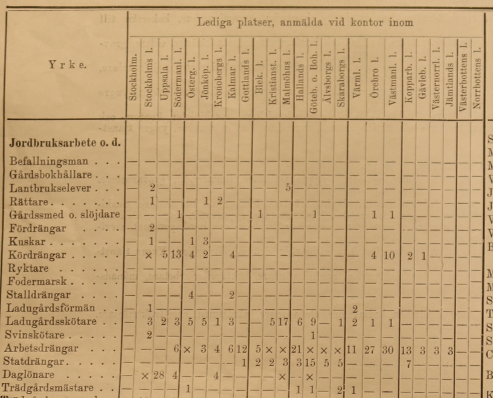

```{r setup, include=FALSE}
knitr::opts_chunk$set(echo = F, message = F, warning = F)

setwd("C:/Users/User/Documents/Recon/swedish-patent-data")

library(tidyverse)
library(knitr)
library(gt)
library(xaringanExtra)
xaringanExtra::use_panelset()
```

Hi Elien,

Thank you for the discussion just now - I appreciate the insight into your data!

I would be very grateful if you are willing to share the codebook for the occupational strings in 1950 to HISCO codes. We would obviously give you a shout out for your hard word - citation stations!

I am working on a [project with my supervisor Kerstin](https://j-jayes.github.io/swedish-patent-data/#1)  on technological change in Sweden in the first half of the 20th century. We are hoping to see the impact of electrification on the labour market, and quantify the new kinds of jobs that are created.

The main source we use has got occupational strings on a list of vacancies produced each week by the Swedish Public Employment Authority. It looks like this:


::::: {.panelset}
::: {.panel}
[Example image]{.panel-name}

:::
::: {.panel}
[Example table]{.panel-name}

```{r}
df <- read_rds("data/riksvakanslistan/vacancies_malmo_17_08_1917.rds")

df %>% 
  head(20) %>% 
  gt() %>% 
  fmt_missing(everything(), missing_text = "-") %>% 
  tab_source_note("Note that code 88 means an indefinite number of vacancies") %>% 
  cols_label(occ = "") %>% 
  tab_spanner(
    label = "Malmöhus län",
    columns = c(
      Malmö:Skurup
    )) %>% 
    tab_spanner(
    label = "Kristianstads län",
    columns = c(
      Kristianstad:Åstorp
    )) %>% 
    tab_spanner(
    label = "Blekinge län",
    columns = c(
      Karlskrona:Sölvesborg
    )) %>% 
  tab_header(title = "Vacancies for the 17th of August 1917",
             subtitle = "Arbetsförmedlingen's district vacancy lists") %>% 
  gt::tab_style(
    style = list(
      cell_text(weight = "bold")
    ),
    locations = list(
      cells_column_labels(gt::everything())
    )
  ) %>% 
   tab_options(
    table.width = px(300),
    table.font.size = "smaller",
    column_labels.font.size = "small"
  )
```
:::
:::::

We are digitizing these lists and counting the occupations that occur each week. Our use for the HISCO codes would be to aggregate together occupations to track the changes in the number of vacancies at a higher level.

We would be very happy to share any additional strings which we find overlapping with your classification.

Thank you for considering my request and please shout if you have any questions. 
