class: inverse, center, middle


```{r, echo=F, message=F, warning=F}
# options(htmltools.dir.version = FALSE)
library(knitr)
opts_chunk$set(
  fig.align="center",  
  fig.height=4, 
  dev = "svg",
  #fig.width=6,
  # out.width="748px", #out.length="520.75px",
  # dpi=300, #fig.path='Figs/',
  cache=F, echo=F, warning=F, message=F
)
library(hrbrthemes)
library(fontawesome)
library(xaringan)
library(xaringanExtra)
library(tidyverse)
# library(here)
library(xaringanthemer)
xaringanExtra::use_panelset()

theme_set(theme_light())

```

```{r}
xaringanExtra::use_progress_bar(color = "#EB821D", location = "top", height = "5px")
```

# To what extent was electric technology **labour augmenting** or **labour replacing** in the first half of the 20th C in Sweden?

---

# TOC

.pull-left[

## Plan

1. [What's the deal with new technology?](#source)

2. [How can we measure this?](#fit)

    [Quick tour of Autor, Salomons and Seegmiller (2021)](#autor)

3. [How can we get the data?](#digitize)

    [Amazon Web Services showcase](#aws)

4. [Questions please!](#questions)

]

.pull-right[

```{r}

```

.center[[Porjus Hydro Plant](https://history.vattenfall.com/stories/from-hydro-power-to-solar-cells/the-pioneer-power-stations) in 1914]

]

---

# Trendy topics

### A few ways in:

.panelset[
.panel[.panel-name[Automation risk]

```{r, out.width="55%"}
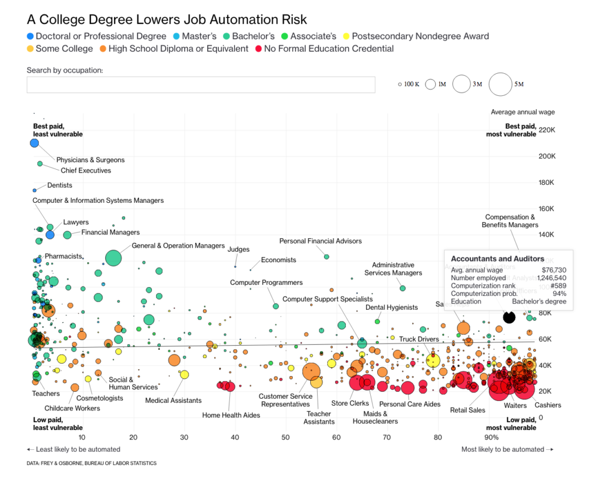
```

.center[Frey and Osbourne (2017) coverage [in Bloomberg](https://www.bloomberg.com/graphics/2017-job-risk/)]

]


.panel[.panel-name[New labour market]

```{r, out.width="60%"}
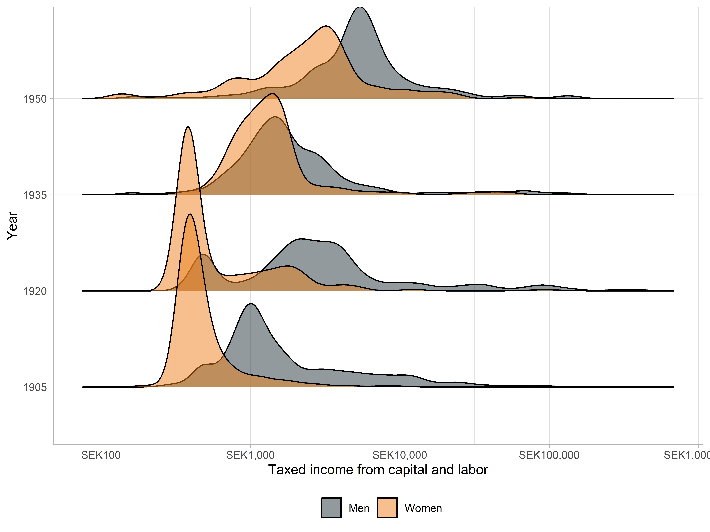
```

.center[Incomes in Malmö - Svensson (2021) [via Twitter](https://twitter.com/AntonSv64176658/status/1455969834513141771)]

]

.panel[.panel-name[Technological change]

```{r, out.width="60%"}
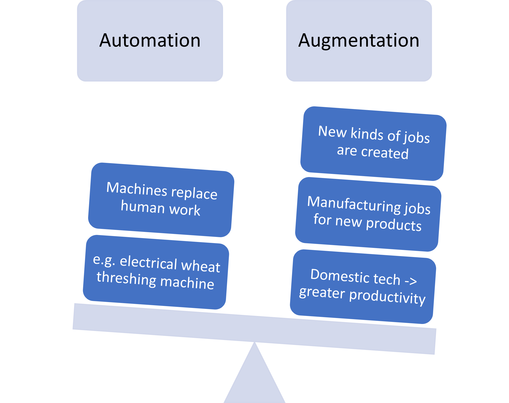
```


]]

---
# New labour market

```{r}
library(gt)
df <- read_rds("literature/svensson_2021.rds")

df %>% 
  pivot_wider(names_from = year) %>%
  gt() %>% 
  data_color(
    columns = `1905`:`1950`,
    colors = scales::col_numeric(
      # custom defined values - notice that order matters!
      palette = c("#ffffff", "#f2fbd2", "#c9ecb4", "#93d3ab", "#35b0ab"),
      domain = NULL
    )
  ) %>% 
  cols_label(title = "") %>% 
   tab_header(
    title = md("**Evolution of professional composition**"),
    subtitle = "Top 100 incomes per year in Malmö"
  ) %>% 
  tab_source_note("Data: Anton Svennson 2022 - strategic sample of Malmö")
```

---
# What literature do we build on?

.pull-left[

- [More power to the people: Electricity Adoption, Technological Change, and Labor Conflict](https://www.cambridge.org/core/journals/journal-of-economic-history/article/more-power-to-the-people-electricity-adoption-technological-change-and-labor-conflict/63B6909C4CEC0038680E0802444862BB) by Jakob Molinder, Tobias Karlsson and Kerstin Enflo.

```{r}
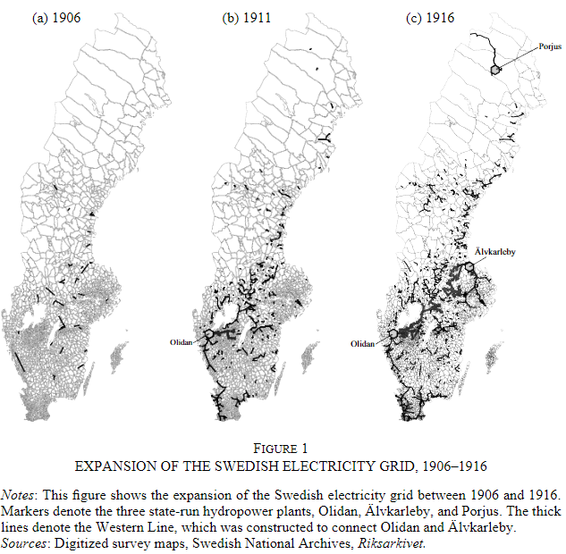
```


]

.pull-right[

- [The social cost of industrialization: Evidence from the Swedish iron industry](https://sites.google.com/view/raoulvanmaarseveen/research) by Adrian Poignant, Roul van Maarseveen and Niklas Bengtsson.

```{r, out.width="90%"}
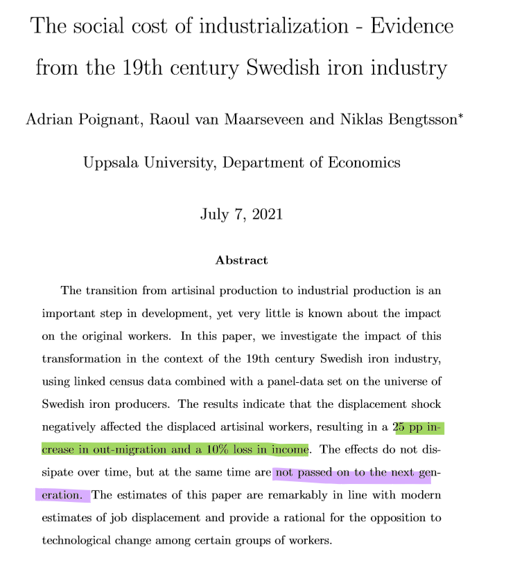
```

]

---
# Why this technology/period?

.pull-left[

There's a lot of electrification happenning!

<blockquote>
Between 1915 and 1920 the proportion of the country's arable land belonging to farms with electricity increased from 5 to almost 40 per cent

</blockquote>
]

.pull-right[

```{r, out.width="80%"}
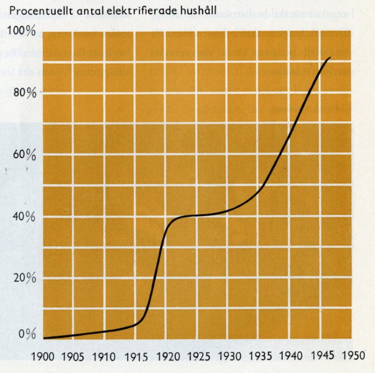
```

.center[[Vattenfall archive](https://history.vattenfall.com/stories/the-revolution-of-electricity/how-electricity-conquered-the-countryside)]

]

---

class: inverse, center, middle
name: fit

# How can we measure technological change?

<html><div style='float:left'></div><hr color='#EB811B' size=1px width=796px></html>
---


# Measuring technological change?

.pull-left[
#### How can we measure **new tasks** and new work that emerge over time?

#### How can we measure if a particular technology **substituted for labour** or **augmented** it?
]

.pull-right[

```{r, fig.cap="Autor, Salomons and Seegmiller (2021)"}
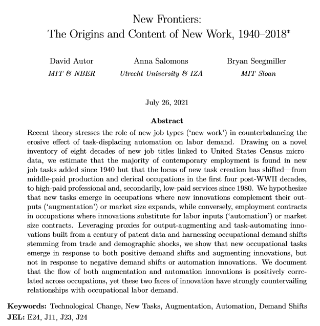
```


]


---

# Methodology


### Following methodology of [Autor, Salomons, Seegmiller (2021)](https://economics.mit.edu/files/21810)

<br>

.pull-left[

We want to compare the similarity of:

1. Labour outputs, e.g. occupational titles,

1. Labour inputs, e.g. a description of what the worker does

and

* Types of new technology being brought to market, e.g. patents

]


.pull-right[

```{r}
autor_needs <- tibble(title = "Medical Technologist",
       tasks = "Performs medical laboratory tests, procedures, analyses to provide data for diagnosis, treatment and prevention of disease",
       tech = "Theranos blood testing machine that can do these things")

# autor_needs %>% kable(col.names = c("Title", "Task", "Tech"))

icons <- tibble(title = "figures/icons/titles.svg",
                tasks = "figures/icons/descriptions.svg",
                tech = "figures/icons/patents.svg")

autor_needs <- autor_needs %>% 
  bind_rows(icons)

autor_needs %>%
  gt() %>%
  tab_header(title = "Example of comparison") %>%
  tab_style(
    style = cell_borders(sides = "l", color = "grey20", style = "solid", weight = "1px"),
    locations = cells_body(
      columns = everything(),
      rows = everything()
    )
  ) %>%
  tab_style(
    style = cell_text(align = "center"),
    locations = cells_body(
      columns = everything(),
      rows = 2
    )
  ) %>%
  cols_label(
    title = md("**Title**"),
    tasks = md("**Task**"),
    tech = md("**Tech**")
  ) %>%
  text_transform(
    locations = cells_body(
      columns = c(title, tasks, tech),
      rows = 2
    ),
    fn = function(x) {
      local_image(
        filename = paste0(x),
        height = as.numeric(75)
      )
    }
  ) %>% 
    tab_style(
    style = cell_fill(color = "#D3D3D3", alpha = .7),
    locations = cells_column_labels(columns = everything())
  )

```


]

---

# Methodology: example

.pull-left[

<br>

```{r}
lat <- tibble(patent = c("US7605498B2: Systems for highly efficient solar power conversion"),
              title = c("Solar photovoltaic electrician"))

icons <- tibble(title = "figures/icons/titles.svg",
                # tasks = "figures/icons/descriptions.svg",
                patent = "figures/icons/patents.svg")

lat %>% 
  bind_rows(icons) %>% 
  gt() %>% 
  cols_label(patent = "Patent",
             title = "Closest title") %>% 
    text_transform(
    locations = cells_body(
      columns = c(patent, title),
      rows = 2
    ),
    fn = function(x) {
      local_image(
        filename = paste0(x),
        height = as.numeric(75)
      )
    }
  ) %>% 
  tab_header(title = "Labour augmenting technology",
             subtitle = "Solar = new tech!")
```


]

.pull-right[

<br>

```{r}
lat <- tibble(patent = c("US3938435A: Automatic mail processing apparatus"),
              title = c("Mail and paper handlers"),
              tasks = c("Sorts and processes mail in post office: Sorts incoming or outgoing mail into mail rack pigeonholes or into mail sacks according to destination"))

icons <- tibble(
  title = "figures/icons/titles.svg",
  tasks = "figures/icons/descriptions.svg",
  patent = "figures/icons/patents.svg"
)

lat %>% 
  bind_rows(icons) %>% 
  gt() %>% 
    cols_label(patent = "Patent",
             title = "Title",
             tasks = "Closest task") %>% 
    text_transform(
    locations = cells_body(
      columns = c(patent, title, tasks),
      rows = 2
    ),
    fn = function(x) {
      local_image(
        filename = paste0(x),
        height = as.numeric(75)
      )
    }
  ) %>% 
  tab_header(title = "Labour automating technology",
             subtitle = "No more mail sorters!")
```


]

---


# Methodology

```{r}
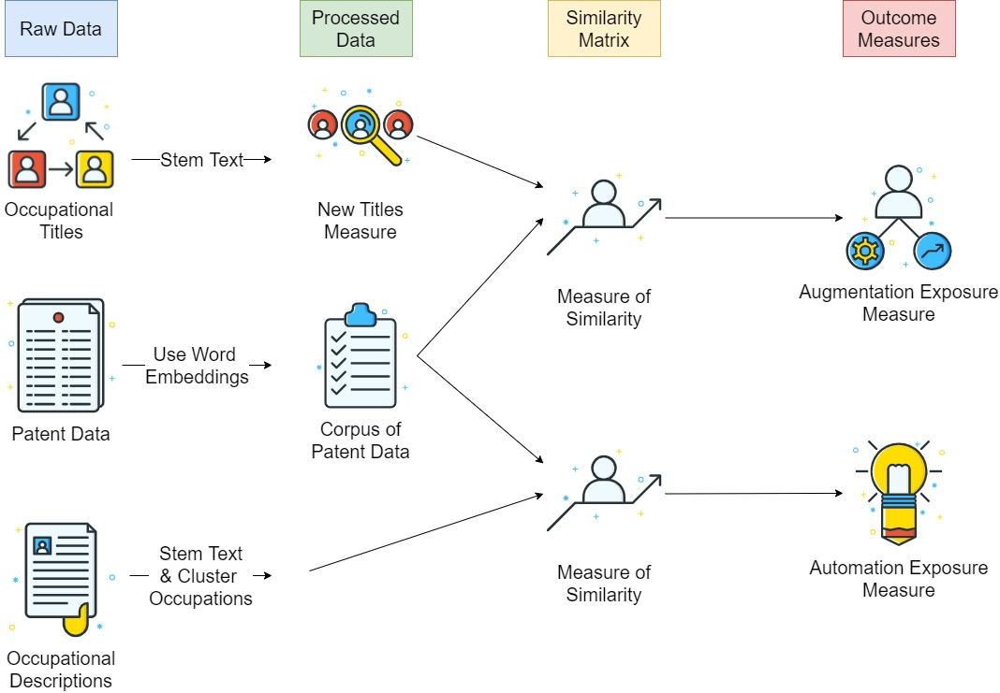
```


---

# What do we add to Autor and the boys?

.panelset[

.panel[.panel-name[An earlier period/country]

```{r}

tibble(names = c("Lin (2011)",
                 "Autor, Salomons, Seegmiller (2021)",
                 "Our project"),
       begin = c(1980, 1940, 1900),
       end = c(2000, 2020, 1960),
       y = c(1, 2, 3)
       ) %>% 
  ggplot(aes(y = y, label = names, x = begin, xend = end, yend = y, colour = names)) +
  geom_segment(cex = 3) +
  geom_label(aes(x = end, y = y, label = names), vjust = 1.5) +
  scale_color_brewer(palette = "Dark2") +
  theme(legend.position = "none") +
  theme(panel.grid.major.y = element_blank(),
        panel.grid.minor.y = element_blank(),
        axis.text.y = element_blank(),
        axis.ticks.y = element_blank()) +
  labs(x = "Years examined",
       y = NULL) +
  coord_cartesian(ylim = c(0.8, NA),
                  xlim = c(NA, 2050))

```


]

.panel[.panel-name[Geographic dimension]


```{r, fig.height=5}
library(sf)
library(scales)

office_locations <- read_rds("data/riksvakanslistan/office_locations.rds") %>%
  filter(!is.na(lat))

office_locations <- st_as_sf(office_locations, coords = c("long", "lat"), crs = 4326)

lan_map_24 <- read_rds("data/riksvakanslistan/county_map/county_map.rds")

lan_map_24 %>%
  ggplot() +
  geom_sf(
    aes(
      fill = population
    )
  ) +
  geom_sf(colour = "midnightblue", data = office_locations) +
  scale_fill_viridis_c(trans = "sqrt", labels = scales::number_format()) +
  labs(
    title = "Location of Arbetsförmedlingen offices in 1927",
    fill = "Population in 1930"
  ) +
  theme_void()
```


]

.panel[.panel-name[Specific technology]

Graphic from section on patents

]


]


---
# Data requirements

```{r}
icons <- tibble(icons = c("figures/icons/titles.svg", "figures/icons/descriptions.svg", "figures/icons/patents.svg",
                          ""),
                description = c("Titles",
                                "Descriptions",
                                "Patents",
                                md("**Status:**")))

sources <- tibble(SCB_ssyk = c("X", "X", "", md("**Acquired**")),
                  google_patents = c("", "", "X", md("**Acquired**")),
                  riksvakanslistan = c("X", "X", "", md("**To digitize**")),
                  prv_patents = c("", "", "X", md("**Acquired**")))

icons %>%
  bind_cols(sources) %>%
  gt() %>%
  tab_header(title = "Sources") %>%
  tab_style(
    style = cell_borders(sides = "l", color = "grey20", style = "solid", weight = "1px"),
    locations = cells_body(
      columns = everything(),
      rows = everything()
    )
  ) %>%
  tab_style(
    style = cell_borders(sides = c("l"), color = "darkred", style = "dashed", weight = "3px"),
    locations = cells_body(
      columns = c(riksvakanslistan),
      rows = everything()
    )
  ) %>%
  tab_style(
    style = cell_borders(sides = c("r"), color = "darkred", style = "dashed", weight = "3px"),
    locations = cells_body(
      columns = c(riksvakanslistan),
      rows = everything()
    )
  ) %>%
  tab_style(
    style = cell_borders(sides = c("t"), color = "darkred", style = "dashed", weight = "3px"),
    locations = cells_body(
      columns = c(riksvakanslistan),
      rows = 1
    )
  ) %>%
  tab_style(
    style = cell_borders(sides = c("b"), color = "darkred", style = "dashed", weight = "3px"),
    locations = cells_body(
      columns = c(riksvakanslistan),
      rows = 4
    )
  ) %>%
  tab_style(
    style = cell_borders(sides = c("r"), color = "grey80", style = "solid", weight = "3px"),
    locations = cells_body(
      columns = description,
      rows = everything()
    )
  ) %>%
  tab_style(
    style = cell_text(align = "center"),
    locations = cells_body(
      columns = everything(),
      rows = everything()
    )
  ) %>%
  cols_label(
    icons = md("**Component**"),
    riksvakanslistan = md("**Riksvakanslistan &\nDistriktvakanslistan**"),
    description = "",
    google_patents = md("**Google Patents**"),
    prv_patents = md("**PRV Patents**"),
    SCB_ssyk = md("**SCB Occ. Classification**")
  ) %>%
  text_transform(
    locations = cells_body(
      columns = icons,
      rows = c(1, 2, 3)
    ),
    fn = function(x) {
      local_image(
        filename = paste0(x),
        height = as.numeric(75)
      )
    }
  ) %>%
  tab_style(
    style = cell_fill(color = "#D3D3D3", alpha = .7),
    locations = cells_column_labels(columns = everything())
  ) %>%
  fmt_markdown(columns = everything(), rows = 4) %>% 
  tab_options(table.width = 800)

```


---

# Riksvakanslistan

```{r}
knitr::include_graphics("data/riksvakanslistan/riksvakanslistan_21_09_1927_small.jpg")
```

---
# Riksvakanslistan: Who is included?
.panelset[
.panel[.panel-name[Table of vacancies]

```{r, out.width="80%"}
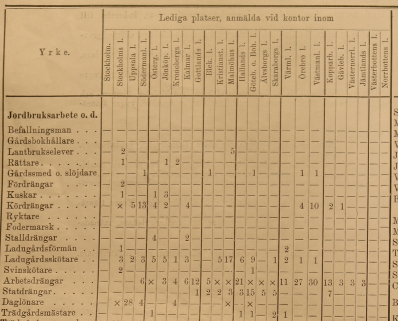
```

]


.panel[.panel-name[Job seekers]

```{r, fig.cap="Generic", out.width="80%"}
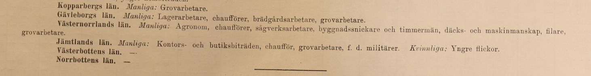

```

```{r, fig.cap="Personalized", out.width="80%"}
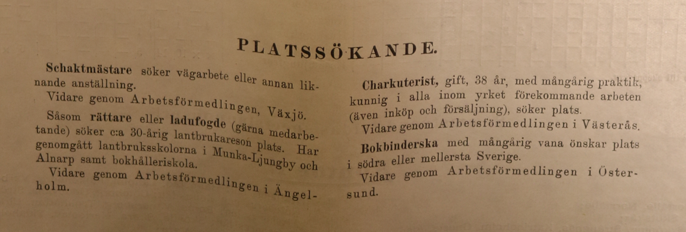

```

]]

---
# Riksvakanslistan: Who is included?

.panelset[
.panel[.panel-name[Occupational types]

.pull-left[

* 5 groups of occupations

* Approx. 100 occupations in table

* Less common occupations listed below table

]


```{r}
occs <- tibble(svk = c("Jordbruksarbete", "Yrkesarbete", "Husligt arbete", "Hotellrörelse", "Kontor och handel"),
       eng = c("Agricultural work", "Professional work", "Domestic work", "Hospitality", "Officework and trade"))

knitr::kable(occs, col.names = c("Occupation", "English translation"))

```

]

.panel[.panel-name[Occupational rankings]

### Recorded vacancies for different skill-levels/ages within similar jobs.

<br>

.pull-left[

```{r}
occs_dairy <- tibble(svk = c("Mejerinnor", "Mejerijungfrur", "Mejerielever"),
       eng = c("Dairy maids", "Dairy girls", "Dairy students"))

knitr::kable(occs_dairy, col.names = c("Occupation", "English translation"))
```


]

.pull-right[

```{r}
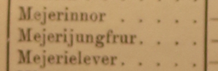
```


]

]

.panel[.panel-name[Required skills]

### Special announcements section includes sometimes detailed job adverts.

<br>

```{r}
shop_assistant <- tibble(svk = c("Handelsbiträde - dekoratör - fri från värnplikt, vana i manufaktur- eller porslins- och glasbranschen, med god smak för skyltning samt kunnig i texting, erhåller anställning i Borås den 1 okt. Begynnelselön 200 kr. per månad. Vidare infromation meddelar Arbetsförmedlingen i Göteborg."),
       eng = c("Sales assistant - decorator - free from military service, used to the manufacturing or porcelain and glass industry, with good taste for signage and knowledgeable in texting, will be employed in Borås on 1 October. Starting salary SEK 200. per month. Further information is provided by the Swedish Public Employment Service."))

knitr::kable(shop_assistant, col.names = c("Vacancy ad", "English translation"))
```


]]


---

# Distriktvakanslistan

.pull-left[
Similar to Riksvakanslistan but:

- More geographic specificity
- No special adverts
- Smaller piece of paper is easier to work with!


]

.pull-right[

```{r, out.width="80%"}
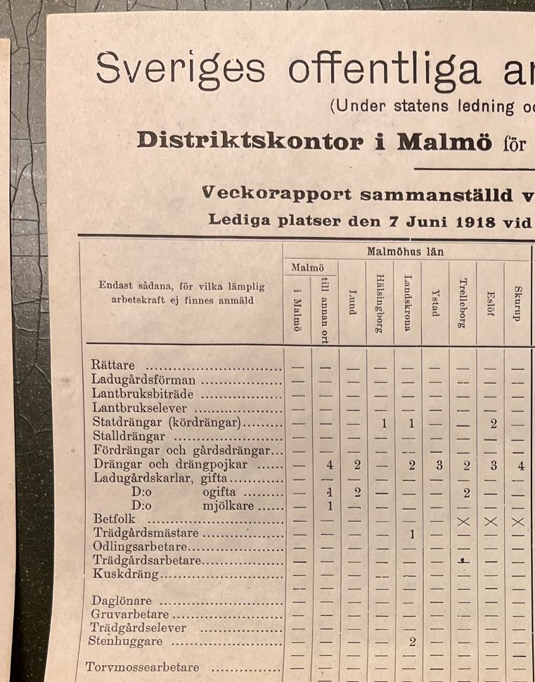
```

.center[Distriktvakanslistan for Malmö - 7 June 1918 - snapshot of document at LUB]

]

---
# Distriktvakanslistan: maps!

```{r}
library(leaflet)
df <- read_rds("data/riksvakanslistan/malmo_map_1.rds")

pal <- colorNumeric(
  palette = "Spectral",
  domain = df$total,
  reverse = T
)

df %>% 
   mutate(label = str_c(stan, " - ", total, " vacancies")) %>% 
  leaflet(width = 800, height = 500) %>%
      setView(lng = 13.6953,
              lat = 55.87887,
              zoom = 8) %>% 
      addProviderTiles("CartoDB.Positron") %>% 
  addCircleMarkers(
    radius = ~ total / 10,
    label = ~ as.character(label),
    color = ~pal(total)
  ) %>% 
  addLegend("bottomright", pal = pal, values = ~ total,
    title = "Number of total vacancies",
    labFormat = labelFormat(),
    opacity = 1
  )
```


---
# Distriktvakanslistan: plots!

### Malmö's relative specificity in hospitality

```{r}
df_hotel <- read_rds("data/riksvakanslistan/df_hotel_temp.rds")

df %>% 
    inner_join(df_hotel %>% select(-hotel)) %>%
  mutate(stan = fct_reorder(stan, total)) %>%
  pivot_longer(c(total, total_hotel)) %>%
  mutate(
    name = case_when(
      name == "total" ~ "Total vacancies",
      TRUE ~ "Hotel related vacancies"
    ),
    name = fct_relevel(name, "Total vacancies")
  ) %>%
  ggplot(aes(value, stan, fill = name)) +
  geom_col(show.legend = FALSE) +
  scale_fill_manual(values = c("#23373B", "#EB821D")) +
  facet_wrap(~name, scales = "free_x") +
  labs(
    x = "Number of vacancies advertised\n7 July 1918",
    y = NULL
  )
```


---

# Patents

- Two sources
- Electricity patents
- Log odds specificity

---

class: inverse, center, middle
name: digitize

# How can we get the data?

<html><div style='float:left'></div><hr color='#EB811B' size=1px width=796px></html>

---

class: inverse, middle

# Regular extraction pipeline

- On my local machine

- Based on regular expression

- Works fine for text

---

# Regular extraction pipeline

.panelset[
.panel[.panel-name[Pre-processing image]

.pull-left[

```{r, eval=F, echo=T}
image <- image_read(here("data", "riksvakanslistan", "kontor.PNG"))

image %>% 
  # tune this parameter
  image_deskew(threshold = 1000) %>% 
  image_despeckle() %>% 
  # makes grayscale
  image_quantize(max = 255, 
                 colorspace = "gray", 
                 dither = T) %>% 
  image_write(here("data", "riksvakanslistan", "kontor_processed.PNG"))
```


]

.pull-right[

```{r, fig.cap="Original image"}
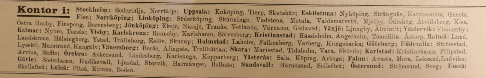
```

```{r, fig.cap="Processed image"}
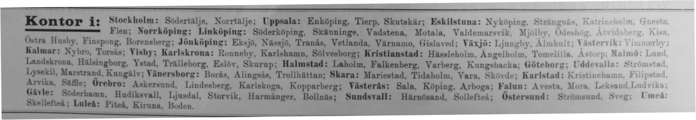
```

]

]

.panel[.panel-name[Extract text]

.pull-left[

```{r, echo=T, eval=F}
library(tesseract)

text <- image %>% 
  # use Swedish language model
  image_ocr(language = "swe")

text
```

]

.pull-right[

```{r}
text <- read_rds("data/riksvakanslistan/text.rds")

text %>% 
  str_squish() %>% 
  knitr::kable(col.names = "Text")
```

]
]


.panel[.panel-name[Transform text]

.pull-left[

```{r, echo=T, eval=F}
text %>% 
  as_tibble() %>% 
  separate_rows(value, sep = "\\;") %>% 
  mutate(value = str_remove(value, "Kontor i:"),
         value = str_squish(value)) %>% 
  separate(value, into = c("Region", "Offices"), sep = "\\:") %>% 
  mutate(Offices = str_squish(Offices))
```

]

.pull-right[

```{r}
text <- read_rds("data/riksvakanslistan/text.rds")

text %>% 
  as_tibble() %>% 
  separate_rows(value, sep = "\\;") %>% 
  mutate(value = str_remove(value, "Kontor i:"),
         value = str_squish(value)) %>% 
  separate(value, into = c("Region", "Offices"), sep = "\\:") %>% 
  mutate(Offices = str_squish(Offices)) %>% 
  filter(!is.na(Offices)) %>% 
  head() %>% 
  knitr::kable()

```


]
]]

---

# It works!

```{r, fig.height=6}
library(sf)
library(scales)

office_locations <- read_rds("data/riksvakanslistan/office_locations.rds") %>%
  filter(!is.na(lat))

office_locations <- st_as_sf(office_locations, coords = c("long", "lat"), crs = 4326)

lan_map_24 <- read_rds("data/riksvakanslistan/county_map/county_map.rds")

lan_map_24 %>%
  ggplot() +
  geom_sf(
    aes(
      fill = population
    )
  ) +
  geom_sf(colour = "midnightblue", data = office_locations) +
  scale_fill_viridis_c(trans = "sqrt", labels = scales::number_format()) +
  labs(
    title = "Location of Arbetsförmedlingen offices in 1927",
    fill = "Population in 1930"
  ) +
  theme_void()
```


---

class: inverse, middle

# AWS Extraction pipeline

- Uses fancy Amazon services Textract and Comprehend

- Based on deep learning

- Works well for tables when you have a good quality scan

---

# AWS Extraction pipeline

```{r}

```

---
# AWS Extraction pipeline

### Demo:

.pull-left[

```{r}
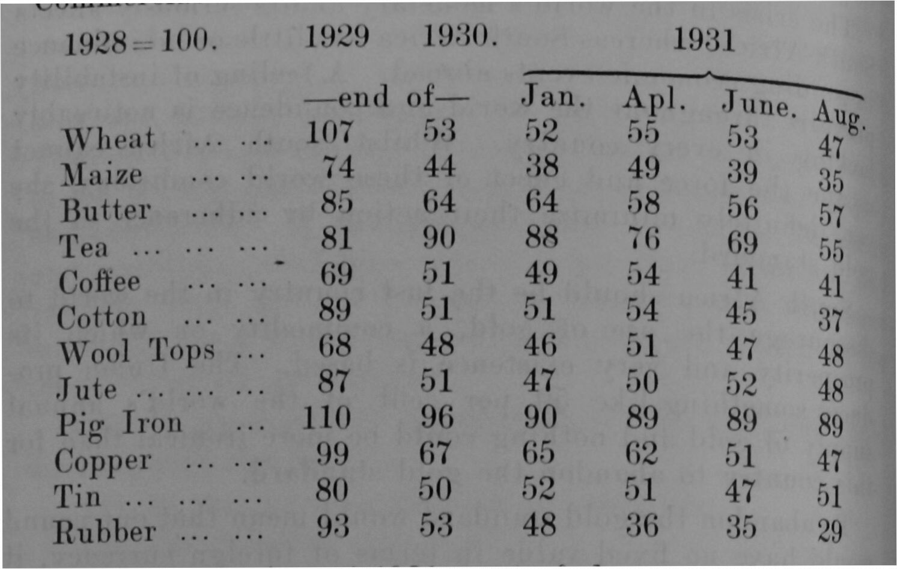
```

]

.pull-right[

```{r}
df <- read.csv("output_1.csv") %>% as_tibble()

df %>% knitr::kable(col.names = c("", "1929", "1930", "1931", "1931", "1931", "1931"))
```


]


---
# AWS Extraction pipeline: works well

```{r, out.width="80%"}
knitr::include_graphics("data/electricity-info/Jonkoping_lan_p60.jpg")
```


---

# AWS Extraction pipeline: works well

```{r}
df <- read_rds("data/electricity-info/jonkopings_power.rds")


df %>%
  # head(10) %>% 
  select(col, kommun, value) %>%
  pivot_wider(names_from = col, values_from = value) %>%
  head(12) %>%
  gt() %>%
  cols_label(
    kommun = "Municipality",
    `2` = "Inhabitants",
    `3` = "Land area",
    `4` = "Cultivated area",
    `5` = "> 3 hectares",
    `6` = "Total",
    `7` = "Households, etc.",
    `8` = "Large industry",
    `9` = "Total",
    `10` = "Households, etc.",
    `11` = "Large industry",
    `12` = "Total"
  ) %>%
  tab_spanner(
    label = "Farm numbers",
    columns = c(
      `5`, `6`
    )
  ) %>%
  tab_spanner(
    label = "Current generation capacity",
    columns = c(
      `7`, `8`, `9`
    )
  ) %>%
  tab_spanner(
    label = "Projected generation capacity",
    columns = c(
      `10`, `11`, `12`
    )
  ) %>% 
  fmt_number(-kommun, decimals = 0) %>% 
  fmt_missing(-kommun, missing_text = " ") %>% 
  tab_header(title = "Power demand within the various municipalities of Jönköpings län") %>% 
   tab_options(
    table.width = px(300),
    table.font.size = "smaller",
    column_labels.font.size = "small"
  ) %>% 
    gt::tab_style(
    style = list(
      cell_text(weight = "bold")
    ),
    locations = list(
      cells_column_labels(gt::everything())
    )
  ) %>% 
    gt::tab_style(
    style = list(
      cell_text(size = "x-small")
    ),
    locations = cells_body(columns = gt::everything(),
                           rows = gt::everything())
  ) 

```


---
# AWS Extraction pipeline: a bit finicky

.pull-left[


```{r}
knitr::include_graphics("slides/distrikt_top_view_r.JPG")
```


]

.pull-right[

```{r}
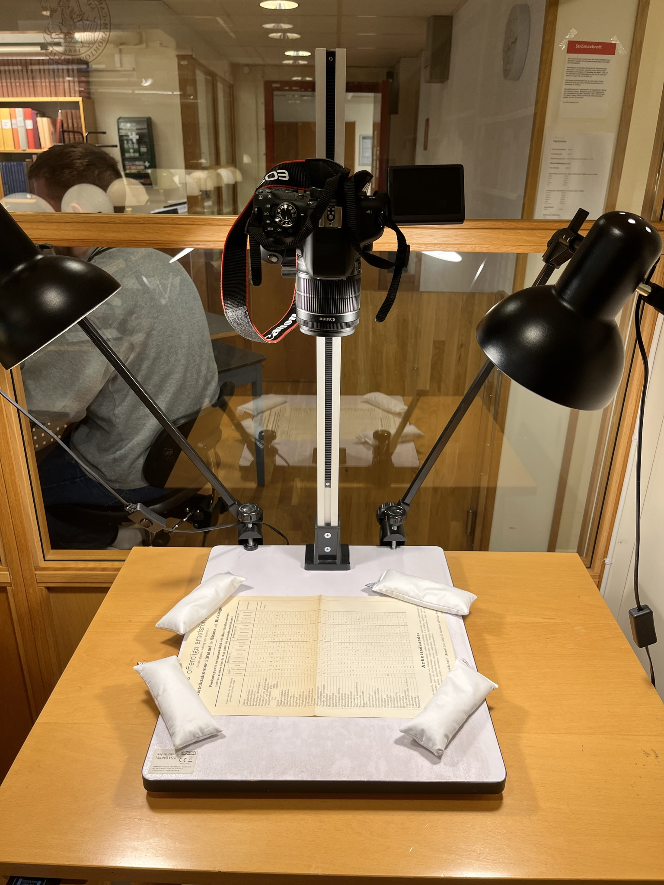
```


]
---
# AWS Extraction pipeline: a bit finicky

```{r}
df  <-  read_rds("data/riksvakanslistan/vacancies_malmo_17_08_1917.rds")

df %>% 
  head(9) %>% 
  gt() %>% 
  fmt_missing(everything(), missing_text = "-") %>% 
  tab_source_note("Note that code 88 means an indefinite number of vacancies") %>% 
  cols_label(occ = "") %>% 
  tab_spanner(
    label = "Malmöhus län",
    columns = c(
      Malmö:Skurup
    )) %>% 
    tab_spanner(
    label = "Kristianstads län",
    columns = c(
      Kristianstad:Åstorp
    )) %>% 
    tab_spanner(
    label = "Blekinge län",
    columns = c(
      Karlskrona:Sölvesborg
    )) %>% 
  tab_header(title = "Vacancies for the 17th of August 1917",
             subtitle = "Arbetsförmedlingen's district vacancy lists") %>% 
  gt::tab_style(
    style = list(
      cell_text(weight = "bold")
    ),
    locations = list(
      cells_column_labels(gt::everything())
    )
  ) %>% 
   tab_options(
    table.width = px(300),
    table.font.size = "smaller",
    column_labels.font.size = "small"
  )
```


---
# Digitizing tips

Things you might be interested in for digitizing your own documents:

1. Cost:

    It's pretty cheap! $1 for 30 patents (~250 pages).

1. Text:

    Keeps structure of text, if you have multiple columns etc. but does not store size of different texts.
    
1. Tables:

    Works fine when you have high quality scans that are flat.

1. Time investment until you have something to work with:

    - AWS account set-up ~ 0.5 day
    - Programming a pipeline to digitize your scans ~ 1 day
    - The actual processing is hella fast!

---
class: inverse, middle, center

# Thank you
