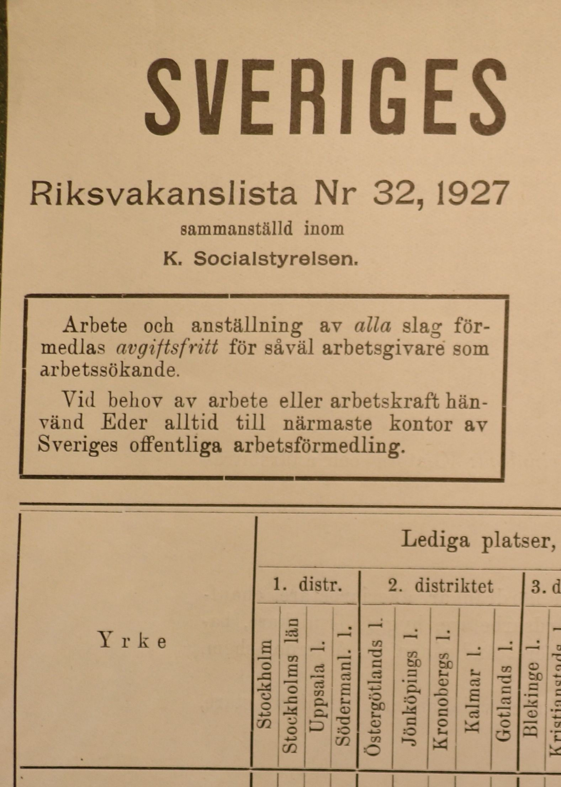

class: inverse

```{r, echo=F, message=F, warning=F}
# options(htmltools.dir.version = FALSE)
library(knitr)
opts_chunk$set(
  fig.align="center",  
  fig.height=4, 
  dev = "svg",
  #fig.width=6,
  # out.width="748px", #out.length="520.75px",
  # dpi=300, #fig.path='Figs/',
  cache=T, echo=F, warning=F, message=F
)
library(hrbrthemes)
library(fontawesome)
library(xaringan)
library(xaringanExtra)
library(tidyverse)
# library(here)
library(xaringanthemer)
xaringanExtra::use_panelset()
```

```{r, out.width="70%"}
# knitr::include_graphics("images/granny-duck-crop.jpg")
```

```{r}
xaringanExtra::use_progress_bar(color = "#EB821D", location = "top", height = "5px")
```


# Riksvakanslistan

.pull-left[

## Plan

1. [What is the source?](#source)

2. [Where does it fit in?](#fit)

3. [How can we digitize it?](#digitize)


]

.pull-right[

```{r}

```


]

---

class: inverse, center, middle
name: source

# What is the source?

<html><div style='float:left'></div><hr color='#EB811B' size=1px width=796px></html>


---

# Riksvakanslistan

```{r}
knitr::include_graphics("data/riksvakanslistan/riksvakanslistan_21_09_1927_small.jpg")
```

---
# Components

.panelset[
.panel[.panel-name[Table of vacancies]

```{r}
knitr::include_graphics("data/riksvakanslistan/top-left-table.PNG")
```

]


.panel[.panel-name[Job seekers]

]

.panel[.panel-name[Special announcements]

]]


---
# Components

.panelset[
.panel[.panel-name[Occupational types]

```{r}
occs <- tibble(svk = c("Jordbruksarbete", "Yrkesarbete", "Husligt arbete", "Hotellrörelse", "Kontor och handel"),
       eng = c("Agricultural work", "Professional work", "Domestic work", "Hospitality", "Officework and trade"))

knitr::kable(occs, col.names = c("Occupation", "English translation"))

```

]


.panel[.panel-name[Occupational rankings]

.pull-left[

```{r}
occs_dairy <- tibble(svk = c("Mejerinnor", "Mejerijungfrur", "Mejerielever"),
       eng = c("Dairy maids", "Dairy girls", "Dairy students"))

knitr::kable(occs_dairy, col.names = c("Occupation", "English translation"))
```


]

.pull-right[

```{r}
knitr::include_graphics("data/riksvakanslistan/mejerinnor.png")
```


]

]

.panel[.panel-name[Required skills]

```{r}
shop_assistant <- tibble(svk = c("Handelsbiträde - dekoratör - fri från värnplikt, vana i manufaktur- eller porslins- och glasbranschen, med god smak för skyltning samt kunnig i texting, erhåller anställning i Borås den 1 okt. Begynnelselön 200 kr. per månad. Vidare infromation meddelar Arbetsförmedlingen i Göteborg."),
       eng = c("Sales assistant - decorator - free from military service, used to the manufacturing or porcelain and glass industry, with good taste for signage and knowledgeable in texting, will be employed in Borås on 1 October. Starting salary SEK 200. per month. Further information is provided by the Swedish Public Employment Service."))

knitr::kable(shop_assistant, col.names = c("Vacancy ad", "English translation"))
```


]]


---

# Where are the offices?

```{r, fig.height=6}
library(sf)
library(scales)

office_locations <- read_rds("data/riksvakanslistan/office_locations.rds") %>%
  filter(!is.na(lat))

office_locations <- st_as_sf(office_locations, coords = c("long", "lat"), crs = 4326)

lan_map_24 <- read_rds("data/riksvakanslistan/county_map/county_map.rds")

lan_map_24 %>%
  ggplot() +
  geom_sf(
    aes(
      fill = population
    )
  ) +
  geom_sf(colour = "midnightblue", data = office_locations) +
  scale_fill_viridis_c(trans = "sqrt", labels = scales::number_format()) +
  labs(
    title = "Location of Arbetsförmedlingen offices in 1927",
    fill = "Population in 1930"
  ) +
  theme_void()
```

---

class: inverse, center, middle
name: fit

# Where does it fit in?

<html><div style='float:left'></div><hr color='#EB811B' size=1px width=796px></html>


---

# Existing occupational title records

```{r, fig.height=5.8}
library(tidytext)
df_occs <- read_rds("data/riksvakanslistan/df_occupations.rds")

df_occs %>% 
  mutate(OCCSTRNG = reorder_within(OCCSTRNG, n, YEAR)) %>% 
  ggplot(aes(n, OCCSTRNG, fill = factor(YEAR))) +
  geom_col() +
  scale_y_reordered() +
  scale_x_continuous(labels = scales::number_format()) +
  scale_fill_viridis_d(option = "D") +
  facet_wrap(~ YEAR, scales = "free") +
  labs(x = "Number of individuals with recorded occupation",
       y = "Occupation",
       caption = "Source: Swedish Census data from IPUMS") +
  theme(legend.position = "none",
        axis.text.y = element_text(size = 11))
```

---

class: inverse, center, middle
name: digitize

# How can we digitize it?

<html><div style='float:left'></div><hr color='#EB811B' size=1px width=796px></html>

---

class: inverse, middle

# Regular extraction pipeline

- On my local machine

- Based on regular expression

- Works fine for text

---

# Regular extraction pipeline

.panelset[
.panel[.panel-name[Pre-processing image]

.pull-left[

```{r, eval=F, echo=T}
image <- image_read(here("data", "riksvakanslistan", "kontor.PNG"))

image %>% 
  # tune this parameter
  image_deskew(threshold = 1000) %>% 
  image_despeckle() %>% 
  # makes grayscale
  image_quantize(max = 255, 
                 colorspace = "gray", 
                 dither = T) %>% 
  image_write(here("data", "riksvakanslistan", "kontor_processed.PNG"))
```


]

.pull-right[

```{r, fig.cap="Original image"}
knitr::include_graphics("data/riksvakanslistan/kontor.PNG")
```

```{r, fig.cap="Processed image"}
knitr::include_graphics("data/riksvakanslistan/kontor_processed.PNG")
```

]

]

.panel[.panel-name[Extract text]

.pull-left[

```{r, echo=T, eval=F}
library(tesseract)

text <- image %>% 
  # use Swedish language model
  image_ocr(language = "swe")

text
```

]

.pull-right[

```{r}
text <- read_rds("data/riksvakanslistan/text.rds")

text %>% 
  str_squish() %>% 
  knitr::kable(col.names = "Text")
```

]
]


.panel[.panel-name[Transform text]

.pull-left[

```{r, echo=T, eval=F}
text %>% 
  as_tibble() %>% 
  separate_rows(value, sep = "\\;") %>% 
  mutate(value = str_remove(value, "Kontor i:"),
         value = str_squish(value)) %>% 
  separate(value, into = c("Region", "Offices"), sep = "\\:") %>% 
  mutate(Offices = str_squish(Offices))
```

]

.pull-right[

```{r}
text <- read_rds("data/riksvakanslistan/text.rds")

text %>% 
  as_tibble() %>% 
  separate_rows(value, sep = "\\;") %>% 
  mutate(value = str_remove(value, "Kontor i:"),
         value = str_squish(value)) %>% 
  separate(value, into = c("Region", "Offices"), sep = "\\:") %>% 
  mutate(Offices = str_squish(Offices)) %>% 
  filter(!is.na(Offices)) %>% 
  head() %>% 
  knitr::kable()

```


]
]]

---

class: inverse, middle

# AWS Extraction pipeline

- Uses fancy Amazon services Textract and Comprehend

- Based on deep learning

- Works well for tables when you have a good quality scan

---

# AWS Extraction pipeline

```{r}
knitr::include_graphics("data/riksvakanslistan/AWS_pipeline (1).svg")
```

---
# AWS Extraction pipeline

### Demo:

.pull-left[

```{r}
knitr::include_graphics("data/riksvakanslistan/gold_standard_1_processed.JPG")
```

]

.pull-right[

```{r}
df <- read.csv("output_1.csv") %>% as_tibble()

df %>% knitr::kable(col.names = c("", "1929", "1930", "1931", "1931", "1931", "1931"))
```


]

---
# Useful Resources:

A [recorded talk](https://www.kellogg.northwestern.edu/news-events/conference/methodological-advances-2021.aspx) from the Methodological Advances in the Extraction and Analysis of Historical Data conference and the [accompanying paper](https://www.angelavossmeyer.com/uploads/5/6/6/2/56627489/northwestern_exeh_amujalavossmeyerdas_paper.pdf) from Angela Vossmeyer and coauthors are a great place to start if you want to do your own digitization with AWS.

```{r}
knitr::include_url("https://www.kellogg.northwestern.edu/news-events/conference/methodological-advances-2021.aspx")
```

---

class: center, inverse, middle

# Thank you


